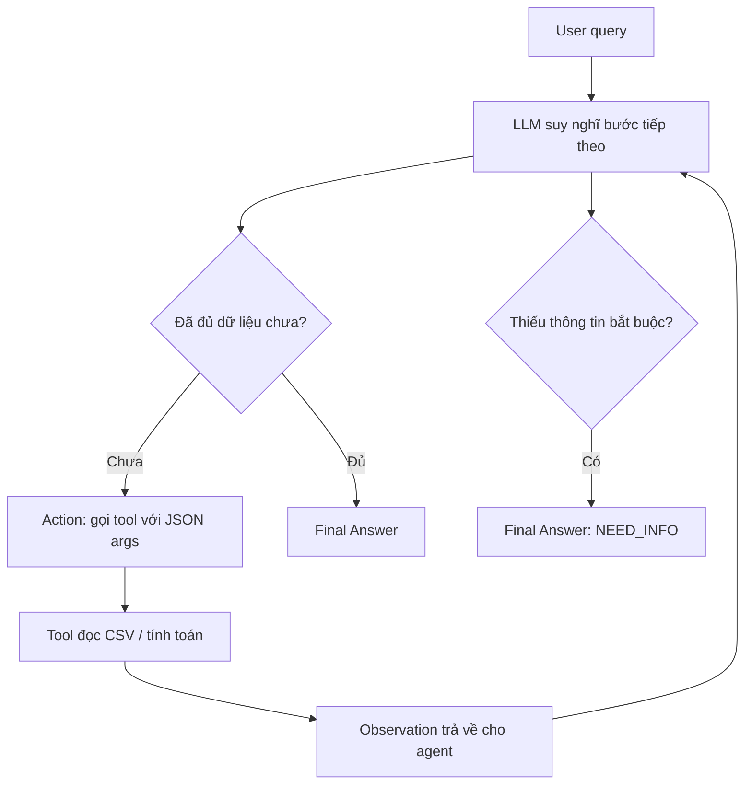

# Báo Cáo Nhóm: 

- **Tên nhóm**: Vietnam Trip Planner Agent
- **Thành viên**: Bùi Ngọc Khánh, Nguyễn Xuân Hiệp, Nguyễn Quang Huy
- **Ngày triển khai**: 2026-06-01
- **Domain lựa chọn**: Trợ lý lập kế hoạch du lịch Việt Nam
- **Model chính**: `deepseek-v4-flash` qua provider `opencode-go`
- **Kết quả evaluation chính**: `report/evaluation_results/eval_results_20260601_222128.json`

---

## 1. Executive Summary

Mục tiêu của nhóm là thực hiện đúng workflow Lab 3: bắt đầu từ chatbot baseline, xây ReAct Agent v1, đọc trace lỗi, sau đó cải tiến thành Agent v2. Ba mốc được dùng trong báo cáo là:

1. **Chatbot baseline**: chỉ trả lời bằng kiến thức và suy luận ngôn ngữ, không được gọi tool, không đọc CSV.
2. **Agent v1**: ReAct loop đầu tiên, có `Thought -> Action -> Observation`, gọi được tool nhưng guardrail còn ít.
3. **Agent v2 final**: bản cải tiến sau failure analysis, LLM vẫn tự chọn tool nhưng có validation để giảm lỗi format, thiếu args, duplicate action và hallucinated Observation.

Nhóm chọn domain **Vietnam Trip Planner Agent** thay vì e-commerce vì bài toán du lịch phù hợp trực tiếp với ví dụ trên bài giảng: tìm chuyến bay, kiểm tra thời tiết, gợi ý đồ mang theo, khách sạn, hoạt động, taxi và tổng chi phí. Pattern ReAct không phụ thuộc domain; chỉ thay bộ tool và dữ liệu.

Kết quả full evaluation mới nhất trên 22 test case:

| Hệ thống | Pass | Review | Fail | Tỉ lệ pass chính thức |
| :--- | ---: | ---: | ---: | ---: |
| Chatbot baseline | 9 | 11 | 2 | 40.9% |
| ReAct Agent v2 | 15 | 7 | 0 | 68.2% |

**Kết luận chính**: Agent v2 tốt hơn chatbot baseline ở các câu cần dữ liệu chính xác, nhiều bước và cần kiểm tra điều kiện từ tool. Tuy nhiên agent vẫn còn hạn chế ở các task rất dài: đôi khi trả lời sớm, tự tính trong Final Answer thay vì gọi `calculate_total_cost`, hoặc suy ra hoạt động từ weather mà chưa gọi `recommend_activities`.

### 1.1 Agentic Fit

Theo framework trong bài giảng, không phải bài toán nào cũng nên dùng agent. Nhóm đánh giá domain du lịch như sau:

| Tiêu chí | Điểm | Lý do |
| :--- | ---: | :--- |
| Multi-step reasoning | 4/5 | Một yêu cầu có thể cần tìm vé, kiểm tra weather, chọn khách sạn, gợi ý hoạt động, tính tổng |
| Tool interaction | 5/5 | Cần đọc nhiều nguồn dữ liệu CSV qua tool |
| Dynamic decision | 4/5 | Bước tiếp theo phụ thuộc Observation, ví dụ nếu mưa thì gợi ý hoạt động trong nhà |
| Long horizon | 3/5 | Một số case kéo dài 4-8 bước, nhưng chưa phải agent tự trị dài hạn |
| **Tổng** | **16/20** | Phù hợp để thử ReAct Agent |

Kết luận: domain này đáng dùng agent vì có multi-step reasoning, tool use và dynamic decision. Với câu đơn giản như chỉ hỏi taxi hoặc weather, chatbot/workflow đơn giản có thể đủ; với câu full planning như T21/T22, agent phù hợp hơn nhưng cần guardrail tốt.

### 1.2 Phạm vi phiên bản được báo cáo

Báo cáo này chỉ trình bày 3 mốc đúng yêu cầu bài tập:

| Phiên bản | Vai trò trong bài | File chính | Được dùng trong báo cáo như thế nào |
| :--- | :--- | :--- | :--- |
| Baseline chatbot | Mốc so sánh ban đầu, không có tool | `chatbot.py`, `prompts/chatbot_baseline.txt` | Có số liệu full run trên 22 case |
| Agent v1 | ReAct agent đầu tiên, vòng lặp text-ReAct cơ bản | `src/agent/agent.py`, `src/agent/agent_v1.py`, `prompts/react_agent.txt` | Dùng để mô tả mốc implementation và failure modes trước cải tiến |
| Agent v2 final | Bản cải tiến LLM-first với guardrails | `src/agent/agent_v2.py`, `prompts/react_agent_v2.txt` | Có số liệu full run trên 22 case, là bản agent cuối cùng để nộp |

Các thử nghiệm trung gian trong quá trình debug không được tính là phiên bản báo cáo. Báo cáo không dùng số liệu của bất kỳ bản định tuyến rule/keyword nào. Bản v2 trong báo cáo là bản cuối: LLM tự chọn tool theo ReAct, code chỉ validate action/format/args/duplicate/Observation.

---

## 2. System Architecture & Tooling

### 2.1 Luồng ReAct



Trong hệ thống này, agent khác chatbot ở chỗ có thêm vòng hành động: chọn tool, nhận Observation, rồi dùng kết quả đó để quyết định bước tiếp theo.

### 2.2 Thành phần chính

| Thành phần | File | Vai trò |
| :--- | :--- | :--- |
| Chatbot baseline | `chatbot.py`, `prompts/chatbot_baseline.txt` | Tạo baseline không dùng tool để so sánh |
| ReAct agent v1 | `src/agent/agent.py`, `src/agent/agent_v1.py` | Vòng lặp text-ReAct cơ bản, parse Action và Final Answer |
| ReAct agent v2 | `src/agent/agent_v2.py`, `prompts/react_agent_v2.txt` | Bản cải tiến có guardrail, validate tool/action, chống hallucinated Observation |
| Tool registry | `src/tools/travel_tools.py` | Các hàm đọc CSV và tính toán |
| Evaluation runner | `run_eval.py` | Chạy chatbot và agent trên test scenario, sinh CSV/JSON kết quả |
| Telemetry | `src/telemetry/logger.py`, `src/telemetry/metrics.py` | Ghi log JSON, latency, token, cost estimate, trace |
| Data & ground truth | `data/*.csv` | Bộ dữ liệu mock và tiêu chí chấm |

### 2.3 Tool Inventory

| Tool | Input chính | Use case |
| :--- | :--- | :--- |
| `resolve_city` | `city_or_code` | Chuẩn hóa tên thành phố/mã sân bay |
| `search_trips` | `origin`, `destination`, `date`, `max_price`, `passengers` | Tìm chuyến bay theo route/ngày/ngân sách/số người |
| `get_weather` | `city`, `date` | Tra dữ liệu thời tiết mock |
| `recommend_outfit` | `temp_high_c`, `rain_probability`, `condition` | Gợi ý đồ mang theo từ weather |
| `search_hotels` | `city`, `max_price_per_night`, `rooms` | Tìm khách sạn theo thành phố/ngân sách |
| `recommend_activities` | `city`, `condition`, `max_price`, `activity_type` | Gợi ý hoạt động theo thời tiết/ngân sách |
| `estimate_local_transport` | `city`, `transport_type` | Ước tính taxi/bus/ride-hailing từ sân bay về trung tâm |
| `calculate_total_cost` | `ticket_price`, `passengers`, `hotel_price_per_night`, `transport_cost`, ... | Tính tổng chi phí cơ bản |

### 2.4 Dữ liệu mock

Bộ dữ liệu nằm trong `data/`, gồm:

| File | Nội dung |
| :--- | :--- |
| `city_aliases.csv` | Alias thành phố và mã sân bay |
| `trips.csv` | Chuyến bay, giá, ghế còn lại, phí hành lý |
| `weather.csv` | Thời tiết theo city/date |
| `hotels.csv` | Khách sạn, giá/đêm, phòng còn lại |
| `activities.csv` | Hoạt động, loại hoạt động, giá, điều kiện thời tiết |
| `local_transport.csv` | Chi phí taxi/bus/ride-hailing |
| `test_scenarios.csv` | 22 câu hỏi test |
| `eval_ground_truth.csv` | Tool cần gọi, expected facts, expected error |

---

## 3. Baseline -> Agent v1 -> Agent v2

### 3.1 Chatbot baseline

Baseline dùng cùng bộ test với agent nhưng bị giới hạn năng lực:

- Không đọc CSV.
- Không gọi search/API/tool.
- Không được nói rằng đã kiểm tra dữ liệu thật.
- Nếu câu hỏi cần dữ liệu chính xác, phải nói rằng cần kiểm tra trong nguồn dữ liệu hoặc hệ thống đặt vé.

Vai trò của baseline là tạo mốc so sánh: với cùng câu hỏi, chatbot trả lời trực tiếp bằng ngôn ngữ, còn agent phải hành động qua tool.

Ví dụ với T03, chatbot baseline trả lời theo kinh nghiệm chung: tháng 6 ở TP.HCM thường mưa, nên mang ô/áo mưa. Câu trả lời nghe hợp lý nhưng không có bằng chứng từ CSV. Đây là giới hạn chính của chatbot trong lab.

### 3.2 Agent v1

Agent v1 là text-ReAct loop cơ bản:

- Prompt yêu cầu LLM trả `Thought` và `Action`.
- Code parse `Action` bằng JSON/function-style parser.
- Tool result được thêm lại vào prompt dưới dạng `Observation`.
- Dừng khi model trả `Final Answer` hoặc vượt `max_steps`.

Hạn chế của v1:

- Dễ gặp parse error nếu LLM bọc JSON trong markdown hoặc viết lệch format.
- Chưa kiểm tra lặp lại cùng một tool call.
- Chưa ngăn model tự sinh `Observation` giả.
- Chưa có cơ chế rõ ràng cho trường hợp thiếu thông tin bắt buộc.

V1 là bản cần có để chứng minh agent đã “biết hành động”, nhưng chưa đủ ổn định. Các lỗi xuất hiện ở giai đoạn này là cơ sở để nâng lên v2 dựa trên trace thực tế.

### 3.3 Agent v2 final

Agent v2 được cải tiến theo hướng: **LLM vẫn tự chọn bước tiếp theo**, còn code chỉ làm guardrail kỹ thuật.

Các cải tiến chính:

| Cải tiến | Mục tiêu |
| :--- | :--- |
| Validate tool name | Không cho gọi tool ngoài registry |
| Required args lấy từ function signature | Tránh duy trì thủ công danh sách tham số trong agent |
| Duplicate action detection | Tránh gọi lại cùng tool với cùng args |
| `HALLUCINATED_OBSERVATION` guardrail | Không cho LLM tự tạo Observation giả |
| `NEED_INFO` marker | Khi thiếu thông tin, agent hỏi lại thay vì đoán |
| Robust city normalization | Xử lý biến thể như `TP.HCM`, `TP. HCM`, `tp hcm` bằng normalize tổng quát |
| Max steps = 8 | Chặn loop dài và giới hạn chi phí |

Bản cuối không dùng định tuyến bằng keyword cố định kiểu “thấy vé thì gọi `search_trips`” hay “thấy mưa thì gọi `get_weather`”. Việc chọn tool thuộc về LLM; code chỉ xác nhận action có hợp lệ hay không.

### 3.4 Tóm tắt khác biệt 3 mốc

| Tiêu chí | Baseline | Agent v1 | Agent v2 final |
| :--- | :--- | :--- | :--- |
| Có tool | Không | Có | Có |
| Có ReAct loop | Không | Có | Có |
| Nguồn dữ liệu chính xác | Không đọc CSV | Observation từ tool | Observation từ tool |
| Xử lý thiếu thông tin | Trả lời/hỏi lại bằng ngôn ngữ | Phụ thuộc LLM | Dùng `NEED_INFO` marker |
| Chống hallucinated Observation | Không áp dụng | Chưa có | Có validator |
| Chống duplicate action | Không áp dụng | Chưa có | Có action signature |
| Mục đích trong báo cáo | Mốc so sánh | Mốc ReAct đầu tiên | Bản final để đánh giá định lượng |

---

## 4. Telemetry & Performance Dashboard

### 4.1 Kết quả evaluation

Nguồn: `eval_results_20260601_222128.json`, 22 scenario.

| Metric | Chatbot baseline | Agent v2 |
| :--- | ---: | ---: |
| Pass | 9 | 15 |
| Review | 11 | 7 |
| Fail | 2 | 0 |
| Success rate | 40.9% | 68.2% |
| Average latency / task | 10,894 ms | 25,597 ms |
| Median latency / task | 9,455 ms | 12,959 ms |
| Max latency / task | 28,247 ms | 129,908 ms |
| Total latency toàn suite | 239,668 ms | 563,131 ms |

Agent v2 có tỉ lệ pass cao hơn chatbot baseline, đổi lại latency, token và cost estimate cũng cao hơn vì mỗi task có thể cần nhiều lượt LLM/tool.

### 4.2 Loop count

| Metric | Agent v2 |
| :--- | ---: |
| Average loop count | 2.91 |
| Median loop count | 2 |
| Max loop count | 8 |

Case dài nhất là `T21`, chạm `8 steps`. Đây là case full multi-tool planning gồm chuyến bay, thời tiết, khách sạn, hoạt động, taxi và tổng chi phí.

### 4.3 Token và cost estimate từ log

Nguồn: `logs/2026-06-01.log`, khoảng chạy full từ `15:08:05Z` đến `15:21:29Z`.

| Metric | Chatbot baseline | Agent v2 |
| :--- | ---: | ---: |
| Số LLM calls | 22 | 64 |
| Tổng tokens | 41,486 | 231,046 |
| Tokens trung bình / LLM call | 1,886 | 3,610 |
| Tổng latency LLM calls | 239,638 ms | 562,991 ms |
| Cost estimate tương đối | 0.4149 | 2.3105 |

Ghi chú: `cost_estimate` là chỉ số ước lượng do tracker nội bộ ghi lại, dùng để so sánh tương đối giữa chatbot và agent, không phải hóa đơn thực tế.

### 4.4 Tool usage

| Tool | Số lần được gọi |
| :--- | ---: |
| `search_trips` | 14 |
| `get_weather` | 8 |
| `recommend_activities` | 4 |
| `search_hotels` | 4 |
| `estimate_local_transport` | 4 |
| `resolve_city` | 3 |
| `recommend_outfit` | 1 |

Tool được gọi nhiều nhất là `search_trips`, phù hợp với domain du lịch. `calculate_total_cost` chưa được gọi trong full run cuối, đây là nguyên nhân chính của nhiều case `review`.

---

## 5. Evaluation Theo Nhóm Scenario

| Độ khó | Tổng case | Pass | Review | Fail |
| :--- | ---: | ---: | ---: | ---: |
| Easy | 4 | 4 | 0 | 0 |
| Edge | 8 | 8 | 0 | 0 |
| Medium | 5 | 2 | 3 | 0 |
| Hard | 5 | 1 | 4 | 0 |

Nhận xét:

- Agent v2 xử lý rất tốt các case easy/edge, đặc biệt là thiếu dữ liệu, không có route, không đủ ghế và thiếu thông tin bắt buộc.
- Agent v2 yếu hơn ở hard cases vì cần nhiều tool liên tiếp, dễ trả lời sớm hoặc chạm `max_steps`.
- Đây là dấu hiệu hợp lý để đề xuất hướng nâng cấp sang state graph hoặc tool planner ở phần production readiness.

### 5.1 Case pass tiêu biểu

| Case | Loại | Tool gọi | Loop |
| :--- | :--- | :--- | ---: |
| T01 | simple trip | `search_trips` | 2 |
| T02 | no budget match | `search_trips` | 2 |
| T03 | trip + weather + outfit | `search_trips -> get_weather -> recommend_outfit` | 4 |
| T06 | weather only | `get_weather` | 2 |
| T11 | missing info | Không gọi tool, hỏi lại ngày đi | 1 |
| T12 | missing weather | `get_weather` | 2 |

### 5.2 Case review còn lại

| Case | Nguyên nhân review | Đánh giá |
| :--- | :--- | :--- |
| T04 | Không gọi `calculate_total_cost` | Final answer tính đúng nhưng trace thiếu tool tính tổng |
| T09 | Thiếu nhắc lại số `1.500.000` | Nội dung chính đúng, metric hơi chặt |
| T15 | Thiếu `recommend_activities` | Agent đánh giá beach suitability từ weather, chưa gọi activity tool |
| T16 | Thiếu `recommend_activities` | Agent liệt kê hoạt động nhưng không gọi tool tương ứng |
| T17 | Không gọi `calculate_total_cost` | Tự cộng vé + taxi trong answer |
| T21 | Thiếu `calculate_total_cost`, chạm 8 steps | Full plan khá đầy đủ nhưng trace chưa gọi tool tổng chi phí |
| T22 | Hỏi lại thông tin khách sạn, chưa hoàn thành full plan | Đây là failure rõ nhất của bản v2 |

---

## 6. Trace Thành Công

### Case T03

**Input**:

```text
Tôi muốn đi từ Hà Nội vào TP.HCM ngày 2026-06-10 cho 2 người dưới 2 triệu mỗi vé. Nếu trời mưa thì nên mang gì?
```

**Trace rút gọn**:

| Step | Action | Observation chính |
| ---: | :--- | :--- |
| 1 | `search_trips(origin=HAN, destination=SGN, date=2026-06-10, max_price=2000000, passengers=2)` | Có `VJ121` giá 1.750.000 và `VN207` giá 1.950.000, đủ ghế |
| 2 | `get_weather(city=Ho Chi Minh City, date=2026-06-10)` | Rainy, 27-32C, rain_probability 0.70 |
| 3 | `recommend_outfit(temp_high_c=32, rain_probability=0.7, condition=rainy)` | Quần áo nhẹ, ô gấp, áo mưa nhẹ, giày nhanh khô |
| 4 | `Final Answer` | Tổng hợp chuyến bay và đồ nên mang khi mưa |

**Vì sao pass**:

- Agent không tự đoán giá vé hay thời tiết.
- Mỗi dữ kiện chính xác đều lấy từ Observation.
- Tool path đúng với ground truth: `search_trips -> get_weather -> recommend_outfit`.

---

## 7. Root Cause Analysis - Failure Traces

### 7.1 Failure Trace 1: Hallucinated Observation

**Case liên quan**: T15/T21 trong log.

**Hiện tượng**:

LLM sinh cả `Action` và `Observation` trong cùng một lượt, ví dụ tự viết kết quả weather/activity trước khi chương trình thật sự gọi tool.

**Log event**:

```text
AGENT_V2_VALIDATION_ERROR
error_code = HALLUCINATED_OBSERVATION
```

**Root cause**:

- Text-ReAct dễ khiến LLM bắt chước format trace đầy đủ và tự viết Observation.
- Prompt đã nói “không tự tạo Observation” nhưng model vẫn có thể drift khi context dài.

**Cách xử lý trong v2**:

- Thêm `_validate_no_hallucinated_observation`.
- Nếu output có dòng `Observation:`, code không chạy tool ngay mà thêm validation error vào scratchpad.
- LLM đọc lỗi và sửa bằng cách chỉ trả `Action` hợp lệ.

**Kết quả**:

Trong T15, guardrail bắt lỗi hallucinated observation ở step 4, sau đó agent gọi `get_weather` thật ở step 5 và trả lời ở step 6. Đây là trace lỗi nhưng được phục hồi thành công.

### 7.2 Failure Trace 2: T21 thiếu `calculate_total_cost`

**Input**:

```text
Tôi muốn đi từ Hà Nội vào TP.HCM ngày 2026-06-10 cho 2 người, vé dưới 2 triệu mỗi người, khách sạn dưới 1 triệu một đêm, nếu trời mưa thì gợi ý hoạt động phù hợp, tính taxi từ sân bay về trung tâm và tính tổng chi phí cơ bản.
```

**Tool đã gọi**:

```text
search_trips -> get_weather -> search_hotels -> recommend_activities -> estimate_local_transport
```

**Tool thiếu**:

```text
calculate_total_cost
```

**Root cause**:

- Agent có đủ dữ liệu thành phần nhưng chọn tự cộng trong Final Answer.
- `max_steps=8` khiến task dài dễ chạm giới hạn.
- Prompt chưa đủ mạnh để bắt buộc “khi user yêu cầu tổng chi phí thì phải gọi `calculate_total_cost`”.

**Ảnh hưởng**:

- Final answer vẫn khá hữu ích và grounded.
- Tuy nhiên theo rubric eval-by-trace, trace thiếu tool tính tổng nên bị `review`.

**Hướng cải tiến**:

- Tăng `max_steps` riêng cho full-plan task hoặc dùng state graph.
- Bổ sung policy: nếu user yêu cầu tính tổng, phải gọi `calculate_total_cost`.
- Tách tool planning thành checklist quan sát được, nhưng cần tránh phụ thuộc test case cụ thể.

---

## 8. Ablation Studies & Experiments

### 8.1 Chatbot baseline vs ReAct Agent

| Loại task | Chatbot baseline | Agent v2 | Nhận xét |
| :--- | :--- | :--- | :--- |
| Câu đơn giản, không cần dữ liệu mock | Có thể trả lời mượt | Cũng trả lời được nhưng chậm hơn | Chatbot có lợi thế latency |
| Cần dữ liệu CSV chính xác | Hay nói chung chung hoặc yêu cầu kiểm tra nguồn khác | Gọi tool và trả số liệu cụ thể | Agent thắng |
| Thiếu dữ liệu hoặc không có route | Dễ suy đoán theo kinh nghiệm | Tool trả failure status và agent báo đúng | Agent đáng tin hơn |
| Multi-tool full planning | Chatbot viết mượt nhưng thiếu ground truth | Agent gọi nhiều tool nhưng đôi khi thiếu tool cuối | Agent tốt hơn, nhưng cần orchestration mạnh hơn |

### 8.2 Prompt v1 vs Prompt v2

| Tiêu chí | v1 | v2 |
| :--- | :--- | :--- |
| Tool selection | LLM tự chọn, ít guardrail | LLM tự chọn, có validate |
| Parse robustness | Dễ parse error | Có fallback đọc JSON object đầu tiên |
| Missing info | Có thể hỏi thường hoặc đoán | Dùng `NEED_INFO` marker |
| Hallucinated Observation | Chưa bắt tốt | Bắt bằng validation error |
| Duplicate action | Chưa kiểm soát | Có action signature để chống lặp |
| Routing theo keyword/test case | Không dùng trong bản báo cáo | Không dùng trong bản báo cáo |

### 8.3 Normalization experiment trong bản v2 final

Một lỗi quan trọng xuất hiện khi LLM truyền `"TP. HCM"` thay vì `"TP.HCM"`. Tool ban đầu không resolve được, dẫn tới `UNKNOWN_CITY`.

Cải tiến:

```text
TP.HCM, TP. HCM, tp hcm -> tphcm
Hà Nội, Ha Noi -> hanoi
```

Đây là xử lý normalize tổng quát ở tầng tool, không phải xử lý riêng cho T21.

---

## 9. Production Readiness Review

### 9.1 Điểm sẵn sàng

- Có tool registry rõ ràng.
- Có log JSON theo từng event.
- Có metric latency, token, cost estimate, loop count.
- Có ground truth và evaluation runner.
- Có guardrail chống hallucinated Observation, unknown tool, thiếu required args, duplicate action.

### 9.2 Rủi ro còn lại

- Text-ReAct vẫn phụ thuộc format output của LLM.
- Agent có thể trả lời sớm trước khi gọi đủ tool.
- Các full-plan task dễ vượt `max_steps`.
- Tool description chưa đủ ràng buộc để bắt buộc gọi `calculate_total_cost`.
- Final answer đôi khi thêm câu hỏi follow-up không cần thiết.

### 9.3 Hướng cải tiến

1. **Native tool calling / JSON Schema**: giảm parse error và hallucinated Observation.
2. **State graph**: tách các node như `plan`, `flight`, `weather`, `hotel`, `activity`, `cost`, `final`.
3. **Tool coverage validator**: trước Final Answer, kiểm tra xem các intent chính đã có Observation tương ứng chưa.
4. **Evaluator LLM hoặc rule-based evaluator tốt hơn**: phân biệt answer đúng nhưng thiếu nhắc lại ngân sách với answer sai thật.
5. **Human escalation**: nếu thiếu dữ liệu hoặc mâu thuẫn chi phí, hỏi lại người dùng thay vì tự sửa.

---

## 10. Phân Công Đóng Góp Nhóm

Nhóm chia việc theo từng cụm chức năng để mỗi thành viên đều có đủ 4 loại đóng góp: dữ liệu, tool/module, test/evaluation và debugging. Vì hệ thống có 8 tool nên không thể chia đúng 2 tool/người; nhóm cân bằng workload bằng cách chia theo cụm nghiệp vụ.

| Thành viên | Data phụ trách | Tool/module phụ trách | Test/evaluation phụ trách | Debugging case chính | Tỉ lệ |
| :--- | :--- | :--- | :--- | :--- | ---: |
| Thành viên 1 | `city_aliases.csv`, `trips.csv`, `baggage_rules.csv` | `resolve_city`, `search_trips`; thiết kế chuẩn hóa route/city và failure status cho flight search | Nhóm case chuyến bay và route: T01-T08 | Lỗi city alias `TP. HCM` dẫn tới `UNKNOWN_CITY` | 33.3% |
| Thành viên 2 | `weather.csv`, `activities.csv` | `get_weather`, `recommend_outfit`, `recommend_activities`; thiết kế flow weather -> outfit/activity | Nhóm case weather/activity/multi-step: T09-T16 | Lỗi `HALLUCINATED_OBSERVATION` khi LLM tự sinh Observation | 33.3% |
| Thành viên 3 | `hotels.csv`, `local_transport.csv`, `eval_ground_truth.csv` | `search_hotels`, `estimate_local_transport`, `calculate_total_cost`; thiết kế cost/eval pipeline | Nhóm case hotel/transport/cost/full-plan: T17-T22 và tổng hợp full evaluation | T21 thiếu `calculate_total_cost` trong trace | 33.3% |

Mỗi cá nhân có báo cáo riêng trong `report/individual_reports/`, gồm đóng góp kỹ thuật, case debug, insight và hướng cải tiến. Cách chia này đảm bảo không có thành viên nào chỉ làm một mảng duy nhất; cả ba đều tham gia vào dữ liệu, module/tool, test và phân tích lỗi.

---

## 11. Kết Luận

Bài lab cho thấy sự khác biệt rõ giữa chatbot và agent:

- Chatbot nhanh hơn, ít tốn token hơn, phù hợp câu đơn giản.
- ReAct Agent chậm và đắt hơn nhưng xử lý tốt hơn các task có dữ liệu, nhiều bước và điều kiện động.
- Quan trọng nhất: phải đánh giá bằng trace, không chỉ nhìn Final Answer.

Kết quả `15/22 pass`, `0 fail` của Agent v2 là đủ tốt để nộp báo cáo, vì hệ thống đã thể hiện được agentic reasoning, tool use, telemetry, failure analysis và quá trình cải tiến từ trace lỗi.
